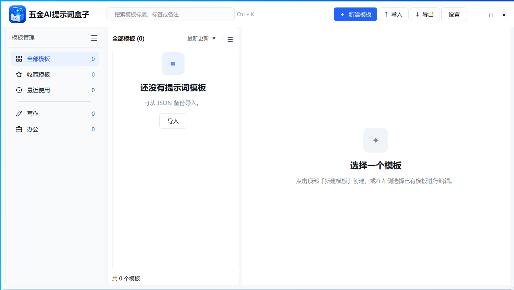

# 五金AI提示词盒子

五金AI提示词盒子，是一个用于保存、分类和管理提示词的小工具。

适合经常使用 AI 写作、编程、绘图、办公的用户，把常用提示词统一保存起来，避免每次都重新翻聊天记录、复制旧内容。

## 软件用途

- 保存常用提示词
- 按分类管理不同用途的提示词
- 快速复制提示词内容
- 方便整理 AI 写作、AI 编程、AI 绘图等常用指令
- 适合个人日常使用
- 支持多国语言

## 截图如下

## 下载方式

请在本仓库右侧的 **Releases** 页面下载最新版本。

下载地址：

👉 请点击右侧 Releases，选择最新版本下载 `.exe` 安装包。

## 更新说明

后续版本更新会放在 Releases 页面中。

## 注意事项

本仓库仅用于发布软件安装包和版本更新说明。

请不要从非官方渠道下载，避免下载到被修改过的版本。

## 当前状态

软件仍在持续优化中，如果使用过程中遇到问题，可以通过作者提供的联系方式进行反馈。
